# 🚀 LPG Core Platform API - Complete Deployment Guide

## 📋 Table of Contents
- [Quick Start (5 minutes)](#quick-start-5-minutes)
- [System Architecture](#system-architecture)
- [Local Docker Deployment](#local-docker-deployment)
- [Development Workflow](#development-workflow)
- [CI/CD Pipeline](#cicd-pipeline)
- [Production Deployment](#production-deployment)
- [Troubleshooting](#troubleshooting)

---

## 🎯 Quick Start (5 minutes)

### Prerequisites
- ✅ Docker & Docker Compose
- ✅ Git
- ✅ curl (for testing)

### Deploy to Local Docker Server

```bash
# 1. Clone the repository
git clone <your-repo-url>
cd lpg-core-platform-api

# 2. Create environment file
cp .env.example .env
# Edit .env if needed (defaults work for local development)

# 3. Build and start all services
docker-compose up -d

# 4. Wait for services to be healthy (30-60 seconds)
docker-compose ps

# 5. Run database migrations
docker-compose exec api sh -c "cd /app && python -c 'from app.db import init_database; init_database()'"

# 6. Test the API
curl http://localhost:7003/healthz
```

🎉 **That's it!** Your API is now running at http://localhost:7003

---

## 🏗️ System Architecture

### Deployment Workflow Diagram


### Service Dependencies


---

## 🐳 Local Docker Deployment

### Full Stack Deployment

#### 1. Environment Setup
```bash
# Copy and configure environment
cp .env.example .env

# Key settings for local development:
vim .env
```

```bash
# Essential settings for local deployment
ENVIRONMENT=development
DEBUG=true
ERP_MODE=legacy
ENABLE_SCHEDULER=false

# Optional: Enable features
ENABLE_AI_ASSISTANCE=true
OPENAI_API_KEY=your-openai-key
LOGFIRE_API_KEY=your-logfire-key
```

#### 2. Deploy Services
```bash
# Option 1: Full stack (API + Database + Admin UI)
docker-compose up -d

# Option 2: Just API + Database
docker-compose up -d api mssql

# Option 3: Development mode with admin UI
docker-compose --profile dev up -d
```

#### 3. Initialize Database
```bash
# Wait for MSSQL to be ready
docker-compose logs -f mssql

# Run migrations
docker-compose exec api python -c "
from app.db import init_database
init_database()
print('✅ Database initialized successfully!')
"
```

#### 4. Verify Deployment
```bash
# Check all services are healthy
docker-compose ps

# Test API endpoints
curl http://localhost:7003/healthz
curl http://localhost:7003/readyz
curl http://localhost:7003/metrics

# Check logs
docker-compose logs -f api
```

### Service Access Points

| Service | URL | Purpose |
|---------|-----|---------|
| 🚀 **API** | http://localhost:7003 | Main API endpoints |
| 📚 **Docs** | http://localhost:7003/docs | Interactive API documentation |
| 🩺 **Health** | http://localhost:7003/healthz | Health check endpoint |
| 🗄️ **Database** | localhost:1433 | MSSQL Server (sa/YourStrong!Passw0rd) |
| 🔧 **Admin UI** | http://localhost:8080 | Database management (Adminer) |

---

## ⚙️ Development Workflow

### Project Structure
```
lpg-core-platform-api/
├── 🐳 docker-compose.yml      # Local deployment
├── 🐳 Dockerfile              # API container
├── 📋 requirements.txt        # Python dependencies
├── 📋 requirements-dev.txt    # Development tools
├── 🔧 mypy.ini               # Type checking config
├── 📝 .env.example           # Environment template
├── 
├── 📁 app/                   # Application source
│   ├── 🎯 main.py           # FastAPI app
│   ├── ⚙️ settings.py       # Configuration
│   ├── 🗄️ db.py             # Database connection
│   ├── 🔌 ports.py          # Protocol interfaces
│   ├── 📁 domain/           # Business logic
│   ├── 📁 adapters/         # External integrations
│   ├── 📁 routers/          # API endpoints
│   └── 📁 sql/              # Database migrations
├── 
├── 🧪 tests/                # Test suite
├── 📁 scripts/              # Utility scripts
├── 📁 .github/workflows/    # CI/CD pipelines
└── 📖 docs/                 # Documentation
```

### Development Commands

#### Local Development
```bash
# Install dependencies
pip install -r requirements.txt -r requirements-dev.txt

# Run type checking
mypy app

# Run tests
pytest

# Run API locally (without Docker)
uvicorn app.main:app --reload --port 7003

# Run with debugger
python -m debugpy --listen 5678 -m uvicorn app.main:app --reload
```

#### Docker Development
```bash
# Build and run
docker-compose up -d --build

# View logs
docker-compose logs -f api

# Execute commands in container
docker-compose exec api bash

# Restart specific service
docker-compose restart api

# Update with new code changes
docker-compose up -d --build api
```

### Adding New Features

1. **Define Protocol Interface** (app/ports.py)
```python
class NewServiceProtocol(Protocol):
    def new_method(self, param: str) -> Dict[str, Any]:
        ...
```

2. **Implement Adapter** (app/adapters/new_service.py)
```python
class NewService(NewServiceProtocol):
    def new_method(self, param: str) -> Dict[str, Any]:
        # Implementation
        return {"result": param}
```

3. **Use in Domain Service** (app/domain/service.py)
```python
def __init__(self, new_service: NewServiceProtocol):
    self.new_service = new_service
```

4. **Add Tests** (tests/test_new_feature.py)
```python
def test_new_feature():
    # Test implementation
    pass
```

---

## 🔄 CI/CD Pipeline

### Pipeline Workflow

```mermaid
graph TD
    A[📝 Code Push] --> B{Branch?}
    B -->|feature/*| C[🧪 CI Pipeline]
    B -->|main| D[🧪 CI Pipeline]
    
    C --> E[Type Check]
    C --> F[Unit Tests]
    C --> G[Integration Tests]
    
    D --> E
    D --> F
    D --> G
    
    E --> H{All Checks Pass?}
    F --> H
    G --> H
    
    H -->|❌ No| I[❌ Block PR/Deployment]
    H -->|✅ Yes| J{Branch is main?}
    
    J -->|No| K[✅ Ready to Merge]
    J -->|Yes| L[🚀 Deploy Pipeline]
    
    L --> M[🐳 Build Docker Image]
    M --> N[📦 Push to GHCR]
    N --> O[🔔 Webhook Trigger]
    O --> P[🚀 Production Deploy]
    
    style A fill:#e3f2fd
    style H fill:#fff3e0
    style P fill:#e8f5e8
```



### GitHub Actions Configuration

#### CI Pipeline (.github/workflows/ci.yml)
- ✅ Python 3.11 setup
- ✅ Install dependencies
- ✅ Type checking with mypy
- ✅ Run pytest suite
- ✅ Parallel execution for speed

#### CD Pipeline (.github/workflows/cd.yml)
- ✅ Build Docker image with commit SHA tagging
- ✅ Push to Docker Hub registry
- ✅ SSH deployment to on-prem production server
- ✅ Health checks and rollback capabilities

### Working Agreement
- 🚫 No direct pushes to `main`
- ✅ All PRs must pass CI checks
- ✅ Protocol interfaces defined first
- ✅ Type safety enforced
- 🔄 Automatic deployment on main merge

---

## 🌐 Production Deployment

### Docker Registry Deployment

#### 1. GitHub Container Registry
```bash
# Images are automatically built and pushed on main branch
# Available at: ghcr.io/yourusername/lpg-core-platform-api

# Pull latest image
docker pull ghcr.io/yourusername/lpg-core-platform-api:latest

# Run production container
docker run -d \
  --name lpg-api \
  -p 7003:7003 \
  -e ENVIRONMENT=production \
  -e DB_DSN="your-production-dsn" \
  -e LOGFIRE_API_KEY="your-key" \
  ghcr.io/yourusername/lpg-core-platform-api:latest
```

#### 2. Portainer Stack Deployment
```yaml
# portainer-stack.yml
version: '3.8'
services:
  lpg-api:
    image: ghcr.io/yourusername/lpg-core-platform-api:latest
    ports:
      - "7003:7003"
    environment:
      ENVIRONMENT: production
      DB_DSN: "your-production-dsn"
      LOGFIRE_API_KEY: "your-key"
      ERP_MODE: official
    restart: unless-stopped
    healthcheck:
      test: ["CMD", "curl", "-f", "http://localhost:7003/healthz"]
      interval: 30s
      timeout: 10s
      retries: 3
```

### Kubernetes Deployment
```yaml
apiVersion: apps/v1
kind: Deployment
metadata:
  name: lpg-core-api
  namespace: production
spec:
  replicas: 3
  selector:
    matchLabels:
      app: lpg-core-api
  template:
    metadata:
      labels:
        app: lpg-core-api
    spec:
      containers:
      - name: api
        image: ghcr.io/yourusername/lpg-core-platform-api:latest
        ports:
        - containerPort: 7003
        env:
        - name: ENVIRONMENT
          value: "production"
        - name: DB_DSN
          valueFrom:
            secretKeyRef:
              name: db-credentials
              key: dsn
        livenessProbe:
          httpGet:
            path: /livez
            port: 7003
          initialDelaySeconds: 30
          periodSeconds: 30
        readinessProbe:
          httpGet:
            path: /readyz
            port: 7003
          initialDelaySeconds: 10
          periodSeconds: 5
        resources:
          requests:
            memory: "256Mi"
            cpu: "250m"
          limits:
            memory: "512Mi"
            cpu: "500m"
---
apiVersion: v1
kind: Service
metadata:
  name: lpg-core-api-service
spec:
  selector:
    app: lpg-core-api
  ports:
  - protocol: TCP
    port: 80
    targetPort: 7003
  type: LoadBalancer
```

---

## 🔧 Troubleshooting

### Common Issues & Solutions

#### 🚨 Database Connection Failed
```bash
# Check MSSQL container status
docker-compose ps mssql

# View MSSQL logs
docker-compose logs mssql

# Test connection manually
docker-compose exec mssql /opt/mssql-tools/bin/sqlcmd \
  -S localhost -U sa -P "YourStrong!Passw0rd" -Q "SELECT 1"

# Solution: Wait for MSSQL to fully start (can take 60+ seconds)
```

#### 🚨 API Health Check Failing
```bash
# Check API container logs
docker-compose logs api

# Test health endpoint directly
curl -v http://localhost:7003/healthz

# Common issues:
# 1. Database not ready - wait longer
# 2. Port conflict - check if 7003 is available
# 3. Environment variables missing
```

#### 🚨 Type Check Failures
```bash
# Run mypy locally
mypy app

# Common issues:
# 1. Missing type annotations
# 2. Protocol not implemented correctly
# 3. Import path issues

# Quick fix for development:
# Add # type: ignore comments (temporarily)
```

#### 🚨 Container Build Issues
```bash
# Clear Docker cache
docker system prune -f

# Rebuild from scratch
docker-compose build --no-cache

# Check Dockerfile syntax
docker build --no-cache .
```

#### 🚨 Permission Issues (macOS/Linux)
```bash
# Fix volume permissions
sudo chown -R $USER:$USER ./logs
sudo chmod -R 755 ./logs

# Fix script permissions
chmod +x scripts/version.sh
```

### Debug Commands

```bash
# View all container logs
docker-compose logs -f

# Execute shell in API container
docker-compose exec api bash

# Check container resource usage
docker stats

# View Docker networks
docker network ls
docker network inspect lpg-network

# Check volume mounts
docker volume ls
docker volume inspect lpg-mssql-data
```

### Performance Monitoring

```bash
# API Metrics endpoint
curl http://localhost:7003/metrics

# Health checks
curl http://localhost:7003/healthz    # Basic health
curl http://localhost:7003/readyz     # Full readiness check
curl http://localhost:7003/livez      # Liveness probe

# Database metrics via Adminer
open http://localhost:8080
# Server: mssql, Username: sa, Password: YourStrong!Passw0rd
```

---

## 📞 Support & Resources

### Quick Reference
- 📖 **API Documentation**: http://localhost:7003/docs
- 🩺 **Health Check**: http://localhost:7003/healthz
- 🔧 **Database Admin**: http://localhost:8080
- 📝 **Logs**: `docker-compose logs -f api`

### Getting Help
1. 🐛 Check logs: `docker-compose logs api`
2. 🔍 Review this guide's troubleshooting section
3. 🆘 Create GitHub issue with logs and error details
4. 💬 Contact the development team

### Useful Resources
- [FastAPI Documentation](https://fastapi.tiangolo.com/)
- [Docker Compose Reference](https://docs.docker.com/compose/)
- [GitHub Actions Documentation](https://docs.github.com/en/actions)

---

**🎉 Congratulations!** You now have a fully deployed LPG Core Platform API with CI/CD pipeline. Happy coding! 🚀